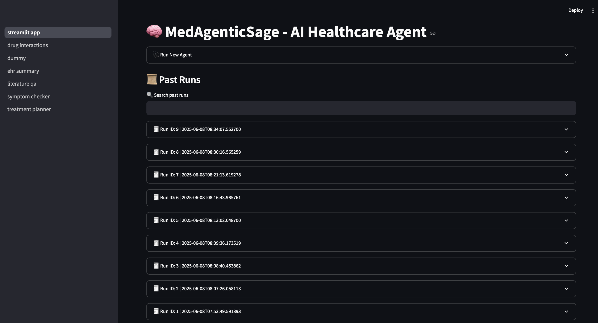
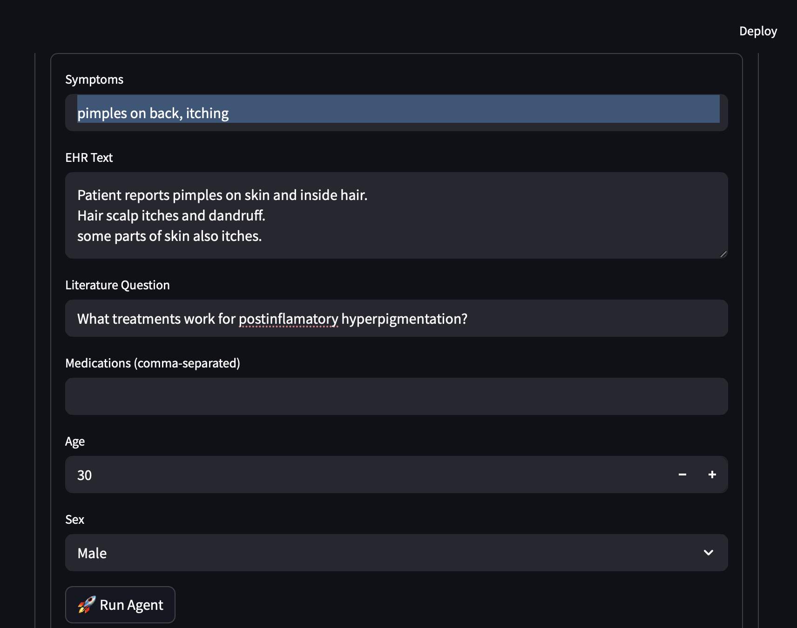
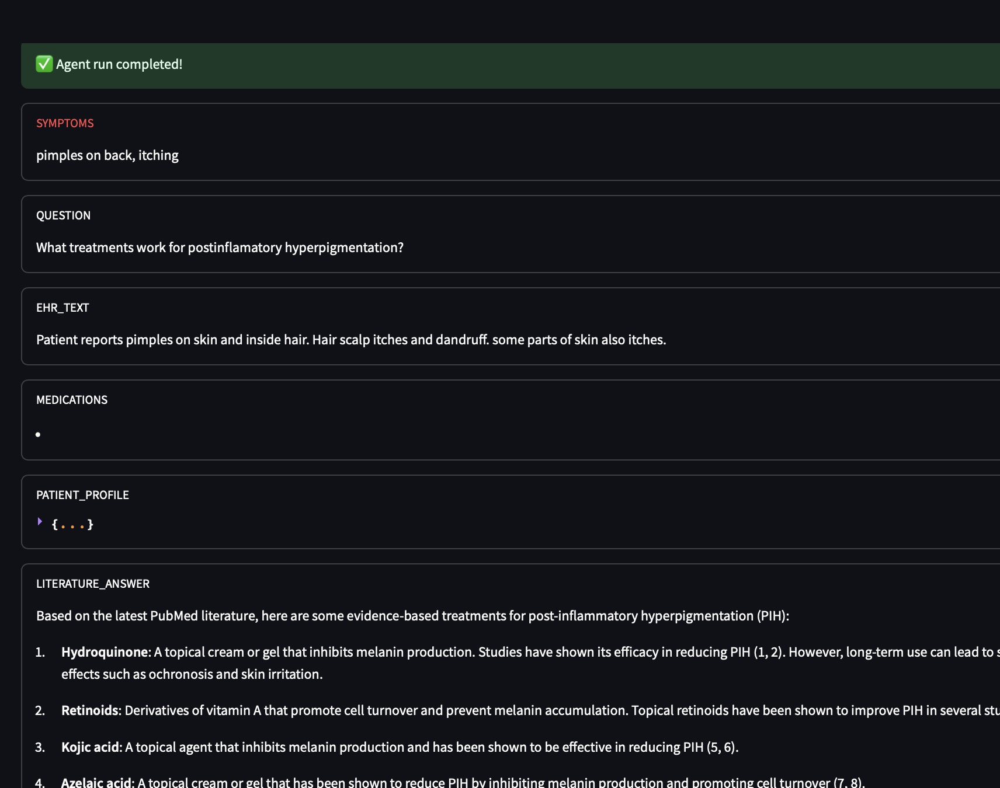
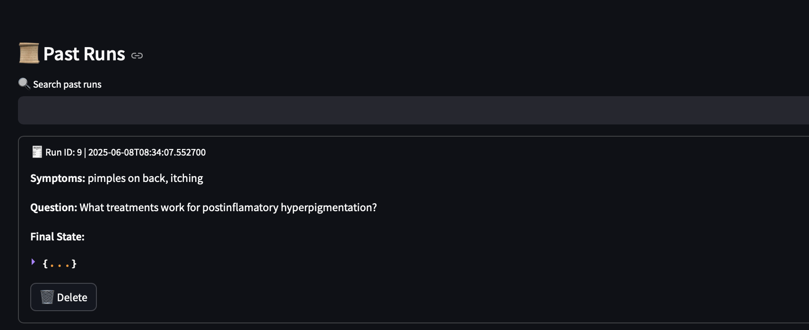
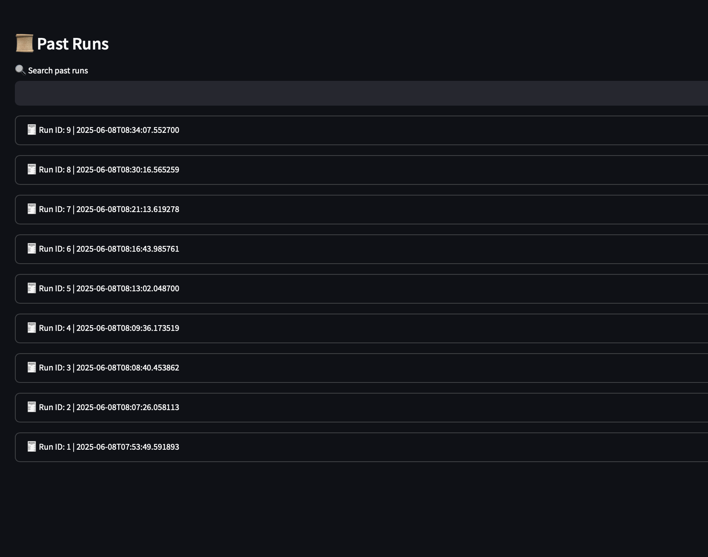
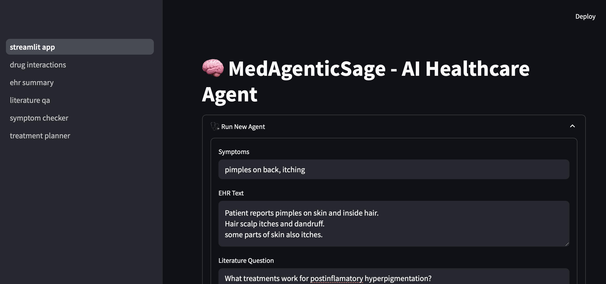

# 🧠 MedAgenticSage: Autonomous AI for Healthcare

**MedAgenticSage** = **Med**icine + **Agentic** AI + **Sage** Wisdom
An autonomous healthcare assistant built with modular AI agents, reasoning graphs, and a user-friendly interface. It combines clinical reasoning with real-world APIs to bring intelligent, personalized, and safe medical insights.

> ✅ Powered by Python, LangGraph, Streamlit, and leading LLMs
> 🚧 ***Still under active development***

---

## 💡 What Can It Do?

An end-to-end, modular agent system for healthcare that can:

* 🔍 Check symptoms → suggest likely diagnoses
* 📋 Summarize clinical notes and EHRs
* 📚 Answer biomedical questions using PubMed
* 💊 Recommend personalized treatment plans
* ⚠️ Analyze drug interactions and medication safety

---

## 🧱 Core Tech Stack

| Layer             | Tools & Frameworks                               |
| ----------------- | ------------------------------------------------ |
| UI                | Streamlit                                        |
| Backend API       | Modular FastAPI-style architecture               |
| Agentic Logic     | LangGraph (agent orchestration), LangChain       |
| LLMs              | GPT-4, Claude, LLaMA, Ollama, Hugging Face, etc. |
| Retrieval         | ChromaDB / FAISS, PubMed API                     |
| Tools/APIs        | DrugBank, OpenFDA, MIMIC (clinical notes)        |
| Memory (optional) | LangGraph Memory, Redis                          |

---

## 📂 Project Structure

```
MedAgenticSage/
│
├── assets/                 # UI mockups and screenshots
│
├── backend/               # Core logic and agent architecture
│   ├── agents/            # All autonomous agent modules
│   ├── db/                # Agent run persistence (SQLite/Mongo)
│   ├── llm/               # LLM loaders (OpenAI, Claude, Ollama, etc.)
│   ├── prompts/           # Prompt templates
│   ├── vector_db/         # Vector store client setup
│
├── configs/               # YAML-based model and app settings
│
├── data/                  # Sample data, persisted states
│
├── frontend/              # Streamlit app
│   ├── components/        # Chat UI and file upload components
│   └── streamlit_app.py   # Main app entry point
│
├── notebooks/             # Development notebooks (prototype modules)
│
├── pyproject.toml         # Poetry or pip-based project config
└── README.md              # Project overview and setup
```

---

## 🚀 Features & Modules

| Module                       | Description                              |
| ---------------------------- | ---------------------------------------- |
| `1_symptom_checker`          | Symptoms → diagnosis via LLM + reasoning |
| `2_ehr_summarizer`           | Summarize clinical notes / EHR free-text |
| `3_literature_qa`            | Ask biomedical questions using PubMed    |
| `4_drug_interaction_checker` | Drug safety + side-effect analysis       |
| `5_treatment_planner`        | Recommend evidence-based treatment plans |
| `6_langgraph_orchestration`  | Combine all agents into autonomous graph |

---

## 📸 Screenshots

### 🖼️ Complete App Structure

> Overview of the full Streamlit interface and component layout.



---

### 📝 Input Form for Running Agents

> Enter patient symptoms, EHR notes, questions, and medications to trigger an AI run.



---

### 🤖 Agent Response Output

> Real-time, multi-agent reasoning output — includes diagnosis, EHR summary, treatment recommendations, and safety checks.



---

### 📂 Past Agent Runs - Summary View

> View previous agent runs in a tabulated format with actions.



---

### 📋 Past Agent Runs - Detailed View

> Expand and inspect inputs and outputs from earlier sessions.



---

### 🧠 App Entry Point

> The landing page of the MedAgenticSage system.



---

## 🖥️ Frontend: Streamlit UI (Live)

* 📄 Upload patient notes or EHRs
* 💬 Chat with the assistant
* 🧠 Run end-to-end agents on new cases
* 🗂️ View and manage past runs

> UI built with modular Streamlit components under `frontend/components/`.

---

## 🧪 Getting Started

1. **Clone the repository**

```bash
git clone https://github.com/sunnyraj94/MedAgenticSage.git
cd MedAgenticSage
```

2. **Install dependencies**

```bash
pip install -e .
```

3. **Set up API keys**

Create a `.env` file in the configs directory:

```env
OPENAI_API_KEY=...
CLAUDE_API_KEY=...
DRUGBANK_API_KEY=...
PUBMED_API_KEY=...
```

4. **Start the app**

```bash
streamlit run frontend/streamlit_app.py
```

Or test notebooks in order:

```bash
notebooks/0_setup_environment.ipynb
```

---

## 🧪 Development Roadmap

| Phase | Focus                      | Status    |
| ----- | -------------------------- | --------- |
| 1     | Modular Jupyter agents     | ✅ Done    |
| 2     | LangGraph orchestration    | ✅ Working |
| 3     | Backend modularization     | ✅ Ongoing |
| 4     | Streamlit UI               | ✅ Live    |
| 5     | Feedback loop + Memory     | ⏳ Next    |
| 6     | Agent tuning (RLHF, logic) | ⏳ Later   |

---

## 📌 Notes

* Each agent is modular, testable, and extendable
* All external API keys are optional but improve accuracy
* Works with both cloud and local LLMs (Ollama, HF, etc.)

---

## ⚖️ License & Attribution

* Uses publicly available medical datasets: MIMIC, HumanDx, PubMed
* Intended for research and educational use only
* Not a substitute for licensed medical advice